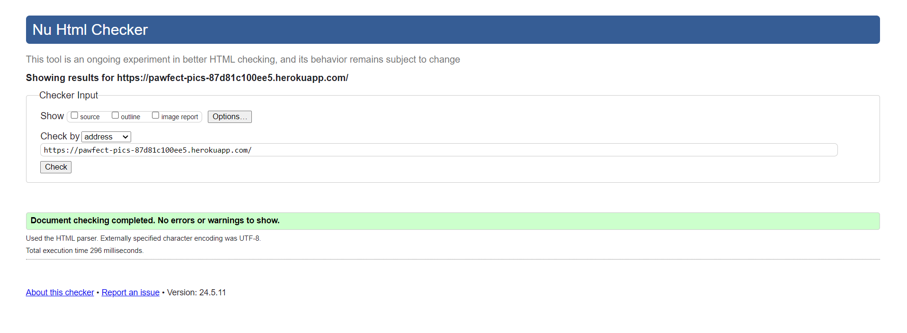
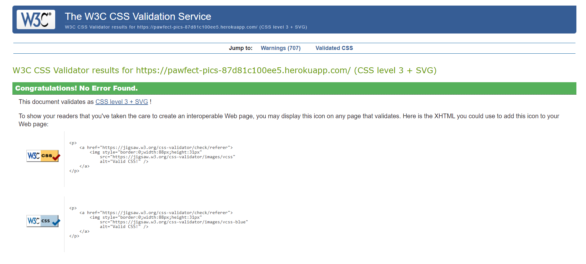
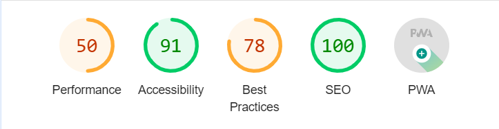
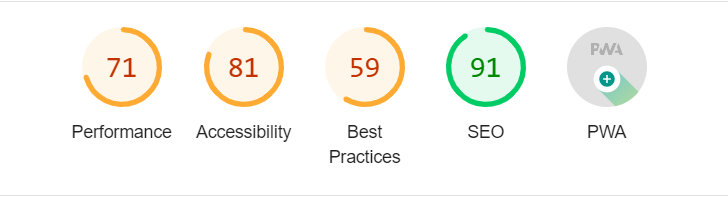
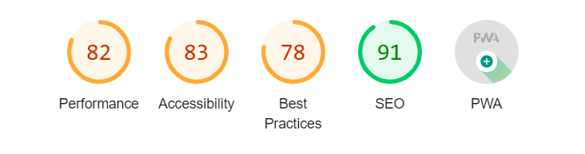
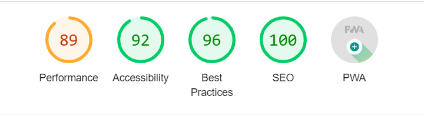
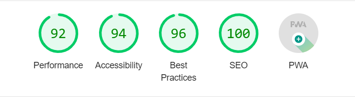
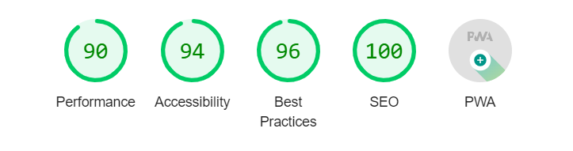

# Testing & Validation

- [Testing & Validation](#testing-validation)
   * [Validation](#validation)
      + [HTML Validation - W3C](#html-validation-w3c)
      + [CSS Validation - Jigsaw](#css-validation-jigsaw)
      + [JavaScript Validation - ESLint](#javascript-validation-eslint)
      + [Lighthouse Validation - Accessibility](#lighthouse-validation-accessibility)
   * [Testing](#testing)
      + [Manual Testing of User Stories](#manual-testing-of-user-stories)
      + [Responsiveness](#responsiveness)
      + [Browser compatibility](#browser-compatibility)

## Validation

The Paws&Snaps site has been passed through the following validators: 
- [WC3 HTML Validator](https://validator.w3.org/)
- [W3C Jigsaw CSS Validator](https://jigsaw.w3.org/css-validator/)
- [ESLint JavaScript Validator](https://eslint.org/)
- [Google Chrome Lighthouse Validator](https://developer.chrome.com/docs/lighthouse/overview/).

### HTML Validation - W3C

[Back to top](#testing--validation)

### CSS Validation - Jigsaw

[Back to top](#testing--validation)

### JavaScript Validation - ESLint

The ESLint validator plugin was used throughout development and no errors were present on final deployment

### Lighthouse Validation - Accessibility

The Chrome Lighthouse Dev Tool was used to test performance, accessibility, best practices and SEO on both desktop and mobile.

**Start here Page - Desktop**

**Add Article Page - Desktop**

**News Page - Desktop**

**Article Page - Desktop**

**Profile Page - Desktop**

**About Page - Desktop**

**Signin Page - Desktop**

**Signup Page - Desktop**

## Testing

### Manual Testing of User Stories

| User Story   | Test  |Expected   | Result   |
|-----------------|---------------------------------------------------------------------------------------------------------------------------------------------------------|-----------------------------------------------------------------------------------------------------------------------------------------------------|-------------|
|`Landing page`|
| As a user I can view the landing page with information about the platform so that I can learn more about it.  | Navigate to https://pawfect-pics-87d81c100ee5.herokuapp.com/  | Landing page loads | As expected |
|`Navbar`|
| As a user I can see the navbar on every page so that I can easily navigate the site.   | As a logged in user visit all the pages on the site.      | Navbar is present on all pages with links to the start here, add article, news, and profile pages and a logout link. | As expected |
|   | As a logged-out user the nav bar is present on the pages with sign-in and sign-up buttons| A logged-out user is redirected to the respective pages.| As expected|
|   |Responsiveness of the Navbar| On smaller screens the navbar collapses into a hamburger button and the display changes to a column| As Expected|
|`Sign and Signup pages`|
| As a new user I can create an account so that I can log into the site.  | Navigate to the signup page and create an account. | Account created and user is sent to sign-in page.| As expected |
| As a returning user I can log in to my account so that I can enjoy the features of the site. | Navigate to the login page, enter your account details and sign in.    | User is sent to the Start hers page   | As expected |
|`Log out`|
| As a user I can log out of my account so that I can keep my account secure on shared computers.      | Once logged in, click the Logout link in the navbar.     | User is logged out and sent to the Start here page.               | As expected |
|
| As a logged in user I can maintain my logged in status so that I can keep using the site.      | Log in and wait for between 1 and 24 hours.      | User is still logged in.   | As expected |
|`Start here page`|
|Popular Article title displayed on Start Here page| The latest ten article titles will be displayed on the Start Here page and the logged-in user will be redirected to that article page on click.| The user was redirected to the respective article page.| As expected. |
|  |  |Logged out users will not be redirected to the Article page|As expected.|
|`News page`|
| As a user, I want to view all the most recent articles, ordered by the most recently created first so that I am up to date with the newest content.| I can view all the published articles as clickable cards with their images and titles and I get redirected to the respective article page on clicking it.|I was redirected to the corresponding article page.|As expected.|
| Search the Articles| The user can search the articles based on the category,author or title and the related articles will be displayed.|Only the corresponding articles were displayed on searching.|As expected.|
|`Add article page`|
| As a user I can create a article so that I can share my information and experiences.   | Log in, navigate to the Add Article form from the navbar, fill out the form, and submit.  | Article is created and the user is navigated to the article page.   | As expected |
|`Article page`|
|As a user, I want to view the article page so that I can read the comments about the article.|Login, Select the article to be read and user gets redirected to that page with the article and corresponding comments.|The user was redirected and all te comments were visible.| As expected. |
|As the owner of an article, I want to edit the title, content, image and published status of my article so that I can make corrections or update my article after it was created.| Select the Article, Click the edit button from the Dropdown and the user will be redirected to the edit form prepoulated with te data and it can be edited and resubmitted.|The  user was redirected and te form could be resubmitted with the new data.| As expected. |
|As, the owner of the Article I want to delete the Article so that I can control the removal of my article from the application.|Find the article, Select the delete button from the dropdown, Delete it.| The article disappears.|As expected.|
|`Comments`|
|As a logged-in user, I want to add comments to an article so that I can share my thoughts about the article.|Login, Select the article and find the Comment form at the bottom, Add comment and get notified that it was submitted and is waiting for admin approval.|Added the comment and on submission the modal was displayed with notification.| As expected. |
|As a user, I want to see the timestamp of a comment to know how long ago it was made so that I can understand the age of the comment.|   |The time stamp is displayed in human readable manner.|As expected. |
|As the owner of a comment, I want to edit my comment so that I can fix or update my existing comment.|Find the comment, Select the edit button from the dropdown, and get the edit form with the previous comment prepopulated in it.Edit te comment and resubmit it.| The new comment appeared.|As expected.|
|As the owner of a comment, I want to delete my comment so that I can control the removal of my comment from the application.|Find the comment, Select the delete button from the dropdown, Delete it.| The comment Disappears.|As expected.|
|`Profile page`|
|As a user, I want to view other users' profiles so that I can see their posts and learn more about them.|Click the Avatar displayed on the Article page or near the comments and get redirected to the profile page of the corresponding user.| The user got redirected to the profile page and can see the profile image, bio, contact data and published article if present.|As expected.|
|As a logged-in user, I want to edit my profile so that I can change my profile picture and update my bio.|Click on the Profile link on the navbar and get redirected to the Profile page with edit button in it. From the edit button select Edit Profile and get redirected to the form with prepopulated profile data.|The user can edit the data from the form and submit it. The edited data appears in the profile page.|As expected.|
|`unpublished article`|
|As owner of the profile I want to see my unpublished article in my profile so that I can make changes and publish it whenever I want.|Login and visit your profile and the unpublished article if present will appear with a red badge on it stating unpublished.|The owner can see the unpublished article with a badge on it.|As expected.|
|`edit username and password`|
|As a logged-in user, I want to update my username so that I can change my display name and keep my profile secure.|Login and go to your profile,Click on the edit button,select the Edit username and get redirected to the form to edit it and submit the form.|The new username appears.|As expected.|
|As a logged-in user, I want to update my password so that I can change my display name and keep my profile secure.|Login and go to your profile,Click on the edit button,select the Edit password and get redirected to the form to edit it and submit the form.|The new password appears.|As expected.|
|`Admin Approval`|
|As the admin of the website, I have access to the admin pane and the privilege to approve the comments.|Login as admin select the comments, and approve the comments and those comments will appear on the website.|Approved comments appeared on the website.|As excepcted.|

### Responsiveness

All pages were tested to ensure responsiveness on screen sizes from 320px and upwards as defined in WCAG 2.1 Reflow criteria for responsive design on Chrome, Firefox and Safari.

Steps to test:

- Open browser and navigate to [Paws&Snaps](https://pawfect-pics-87d81c100ee5.herokuapp.com/)
- Open the developer tools (right click and inspect)
- Set to responsive and decrease width to 320px
- Click and drag the responsive window slowly to maximum width

Expected:

Website is responsive on all screen sizes and no images are pixelated or stretched. No horizontal scroll is present. No elements overlap.

Actual:

Website behaved as expected.

[Back to top](#testing--validation)

### Browser compatibility

Testing has been carried out on the following browsers:

- Google Chrome
- Firefox
- Safari

[Back to top](#testing--validation)
